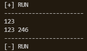

# bf-ext
### кратко о языке
bf-ext является расширением языка [brainfuck](https://ru.wikipedia.org/wiki/Brainfuck)  

### отличительные особености
1. ориентированность на [различные внешние устройства](specifications/device/std_dev_ru.md)   
2. память обладает [специальной структурой](specifications/device/cem_ru.md) 


# Реализованные возможности
+ виртуальная машина (ВМ) для [процессора](specifications/cpu_std_ru.md) 
и эмулятор [устройств](specifications/device/std_dev_ru.md).
+ компилятор bf-ext для [процессора](specifications/cpu_std_ru.md) 
и запуск полученного бинарного кода на ВМ.
+ дизасемблер из бинарного кода в комманды соотв.(в данный момент единственнного) процессора.

# Подробно о языке
#### [перечень команд](specifications/bf_ext_spec.md)

### синтаксис
все пробельные символы игнорируются (в данный момент и в include секции)

### комментарии
`;` - символ начало комментария, все символы в строке идущие после `;` игнорируются  

### макросы
`# macro-name # seq-cmd #` - определение макроса.  
`%macro-name%` - использование макроса, на его место ставится `seq-cmd` из соотв. макроса.  
одно и тоже имя не может дважды использоваться дважды для определения макроса.  
макрос не может использоваться перед своим определением.  
макросы могут быть вложенными.  

### настройки
`'setting-name'` - подключение настройки. компилятор попытается выполнить соотв. действия.   
общий вид: `param-0[add-param-0-1|...|add-param-0-K]:...:param-N[add-param-N-1|...|add-param-N-M]`  

существующие настройки:  
+ `'dis-all-dev'` - отключает все подключенные устройства
+ `'port-name:name:value'` - устанавливает порт `name` в значение `value`
  + особую роль при компиляции для виртуальной машины играют `port-name:console:X` и `port-name:screen:X`  
  (сейчас возможна компиляция только для ВМ, в будущем возможно будет добавлен интерпретатор) 
  + + `port-name:console:X` - дополнительно к обычной функции говорит скомпилировать дополнительный код для установки портового регистра консоли.  
  Это нужно для использования команд `. ,`.  
  Иначе консоль можно будет использовать но только посредством команд `s t r w`  
  (его установку можно написать на ассемблере ВМ, но не на bf-ext)  
  + + `port-name:screen:X` - тоже самое, но для экрана. 
  Нужно для использования команд `4 8 6 2 5 @ 9`.
+ подключение устройства:
  + `'dev:dev-name:dev-param-0=value-0:...:dev-param-N=value-N'` - подключает устройство
  с именем `dev-name`  в любой порт c параметрами 0-N с именами dev-param-X и соотв. значениями dev-param-X.  
  Если параметр не указан явно то он устанавливается в значение по умолчанию. 
  + `'dev[port]:dev-name: ..dev-params..'` |  - подключает устройство с именем `dev-name` в порт `port` 
  (`port` может быть либо числом либо именем порта)  и с параметрами как в пред. пунтке. 
  + + например `dev[console]:utf8-console` - подключает utf8-консоль.
  + + а `dev[screen]:std-win:w=500` - подключает экран и говорит что его ширина должна быть 500 пикселей. 
  
### include
`## path-to-other-bf-ext-file #` - подключает файл `path-to-other-bf-ext-file` только с возможностью определения макросов, 
если в файле есть настройки или код компилятор выдаст ошибку.  

`##'# settings-file #` - подключает файл `settings-file` только с возможностью подключения настроек, 
если в файле определены макросы или присутствует код компилятор выдаст ошибку.

`##!# settings-file #` - подключает файл `settings-file` с возможностью подключения настроек и определения макросов, 
если в файле есть код компилятор выдаст ошибку.

# Параметры запуска программы
```
USAGE:
    bf_cell_gen.exe [OPTIONS] <--example <X>|--file <X>>

OPTIONS:
    -e, --example <X>
            компилирует и запускает на ВМ примера с номером X из папки examples/examples/

    -f, --file <X>
            путь к файлу bf-ext для последующей компиляции и запуска на ВМ

        --hardware-port-amount <HARDWARE_PORT_AMOUNT>
            [HARDWARE INFO]: количество портов(максимально возможное кол-во подключенных устройств) [по умолчанию: 64]

        --hardware-cem-port <HARDWARE_CEM_PORT>
            [HARDWARE INFO]: CEM port [по умолчанию: 2]

        --hardware-com-port <HARDWARE_COM_PORT>
            [HARDWARE INFO]: COM port [по умолчанию: 1]

        --hardware-max-jump-size <HARDWARE_MAX_JUMP_SIZE>
            [HARDWARE INFO]: максимальная длина прыжка [по умолчанию: 1 << 20]

        --help
            выводит ~данное сообщение(на английском)

        --need-bin
            нужно ли генерировать бинарный код?

        --need-disasm
            нужно ли генерировать дизасемблер?

        --path-bin <PATH_BIN>
            путь к папке для сохранения бинарного кода [по умолчанию: "generated/"]

        --path-disasm <PATH_DISASM>
            путь к папке для сохранения дизасемблера [по умолчанию: "generated/"]
```

# примеры
### #1
компиляция и запуск на ВМ кода который выводит строку `helwo demvice wowld?\n` в консоль.

для запуска используйте одни из след. параметров:
+ `-e 1` - примеры из [папки](https://github.com/Nikita-str/brainfuck-ext--cell-gen-and-devs/tree/master/examples/examples) можно запускать по номеру 
+ `-f examples/examples/01_helwo_demv_wowld.bf-ext` - с указанием пути


### #2
компиляция и запуск на ВМ кода который отображает на экране фразу `HELLO SCREEN WORLD` попеременно двумя цветами.

для запуска используйте, например, `-e 2`


### доказательство "сахарности" умножения
для запуска используйте `-f examples/proof_of_sugarity_some_cmds/proof_mul.bf-ext`  



первая строка на скрине - пользовательский ввод.  
вторая - вывод программы.

### другие
другие примеры весьма похожи, можете запустить их самостоятельно. 
